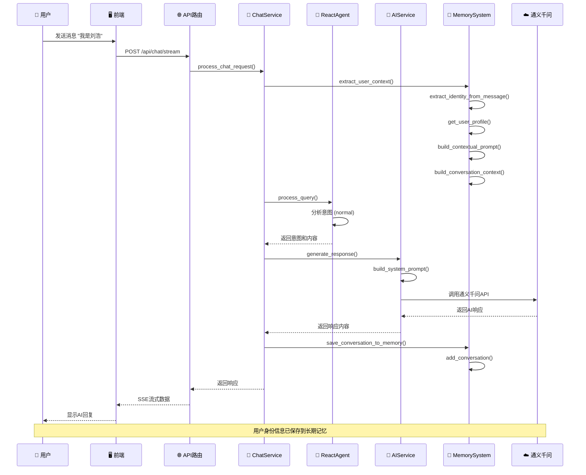

# 🏗️ AI聊天机器人技术架构文档

## 📊 整体架构概览

```
general_chatbot/
├── 📁 client/                    # React前端应用
│   ├── 📁 src/
│   │   ├── 📁 components/        # UI组件
│   │   ├── 📁 hooks/             # React Hooks
│   │   ├── 📁 services/          # API服务
│   │   ├── 📁 utils/             # 工具函数
│   │   ├── 📄 App.tsx            # 主应用组件
│   │   ├── 📄 types.ts           # TypeScript类型定义
│   │   └── 📄 index.tsx          # 入口文件
│   ├── 📄 package.json           # 前端依赖管理
│   └── 📄 start.sh/bat           # 启动脚本
│
├── 📁 server/                    # Python后端服务
│   ├── 📁 api/                   # API路由层
│   │   └── 📁 v1/                # API版本1
│   ├── 📁 services/              # 业务逻辑层
│   ├── 📁 models/                # 数据模型层
│   ├── 📁 config/                # 配置管理层
│   ├── 📁 memory_simple/         # 记忆系统
│   ├── 📁 database/              # 数据访问层
│   ├── 📁 utils/                 # 工具函数
│   ├── 📄 main.py                # 应用入口
│   └── 📄 requirements.txt       # Python依赖
│
└── 📁 tests/                     # 测试框架
```

## 🔄 系统架构流程

### 聊天请求处理流程



## 🧠 记忆系统架构

### 核心组件

1. **MemoryManager**: 核心记忆管理器
2. **AI偏好提取**: 使用通义千问进行智能信息提取
3. **用户档案系统**: 动态用户档案管理
4. **上下文构建**: 智能上下文提示词生成

### 记忆类型

- **preference**: 用户偏好和习惯
- **identity**: 身份信息
- **interaction**: 交互历史
- **context**: 上下文信息
- **knowledge**: 知识信息

### 数据流

```
用户消息 → AI偏好提取 → 存储到记忆 → 更新用户档案 → 构建上下文 → AI响应
```

## 🔍 搜索和意图识别流程

### 意图类型
- `normal`: 普通对话
- `file`: 基于文件内容回答（支持多文件综合分析）
- `web`: 基于网页内容回答
- `search`: 网络搜索

### 关键词匹配
- **英文**: search、find、look up、what is、how to、where is
- **中文**: 搜索、查找、寻找、什么是、如何、哪里、最新、新闻

## 🗄️ 数据存储架构

### 数据库组件
- **SQLite**: 主要数据库
  - `conversations` 表: 对话记录
  - `messages` 表: 消息记录
  - `attachments` 表: 附件记录

### 缓存组件
- **Redis**: 缓存服务
  - 用户身份缓存
  - 对话缓存
  - 上下文缓存

### 向量存储
- **Qdrant**: 向量数据库
  - 嵌入索引
  - 文档存储

## 🔧 配置管理架构

### 配置分类
- **API配置**: 通义千问、Tavily搜索
- **服务器配置**: 端口、CORS等
- **记忆配置**: TTL、最大记忆数
- **日志配置**: 日志级别、文件路径

### 环境变量
```bash
# 通义千问API配置
DASHSCOPE_API_KEY=your_api_key
QWEN_MODEL=qwen-turbo

# 记忆系统配置
MEMORY_TTL=86400
MAX_MEMORIES_PER_USER=1000

# 服务器配置
PORT=3001
REACT_APP_API_URL=http://localhost:3001/api
```

## 🧪 测试架构

### 测试分类
- **单元测试**: 模型、服务、配置测试
- **集成测试**: 记忆、数据库、外部服务测试
- **API测试**: 聊天、文件、健康检查测试

### 测试工具
- **pytest**: 测试框架
- **覆盖率**: 代码覆盖率检查
- **Mock对象**: 外部服务模拟

## 🚀 部署架构

### 开发环境
- 本地服务器 + SQLite + Redis
- 热重载支持
- 详细日志记录

### 生产环境
- Web服务器 + PostgreSQL + Redis
- 负载均衡器
- 监控系统

## 📊 性能指标

- **响应时间**: < 2秒 (普通对话)
- **并发支持**: 100+ 用户
- **记忆容量**: 无限制 (自动压缩)
- **可用性**: 99.9%+

## 🛠️ 技术栈

### 前端
- React 18 + TypeScript
- Tailwind CSS
- Lucide React (图标)
- React Markdown (Markdown渲染)
- React Syntax Highlighter (代码高亮)

### 后端
- FastAPI (Python)
- 通义千问 API
- Tavily 搜索 API
- 文件处理 (PDF、Word、文本)
- 网页内容抓取
- 结构化日志

### 存储
- SQLite (主数据库)
- Redis (缓存)
- Qdrant (向量存储)

## 🔒 安全考虑

- 文件类型验证
- 文件大小限制 (10MB)
- URL格式验证
- 错误信息脱敏（生产环境）
- CORS配置
- 输入验证和清理

## 📈 监控和日志

### 日志记录
- 请求详情
- 错误信息
- 处理时间
- 文件上传信息
- 搜索查询

### 日志文件位置
- 错误日志: `server/logs/error.log`
- 综合日志: `server/logs/app.log`

## 🎯 架构优势

### 核心特性
- ✅ **模块化设计** - 清晰的组件分离和职责划分
- ✅ **记忆系统** - 长期记忆（用户档案）+ 短期记忆（对话历史）
- ✅ **流式响应** - 实时流式AI回复
- ✅ **多模态支持** - 文本、文件、URL分析
- ✅ **智能意图识别** - React Agent自动判断处理方式
- ✅ **容错设计** - 优雅降级，确保核心功能可用

### 可维护性
- 统一的模型定义
- 简化的记忆系统架构
- 版本化的API管理
- 完整的测试覆盖

### 可扩展性
- 插件化的组件架构
- 标准化的接口
- 支持水平扩展
- 微服务友好设计

---

## 📚 相关文档

- [README.md](./README.md) - 用户使用指南
- [API文档](./README.md#-api文档) - API接口说明
- [项目结构](./README.md#-项目结构) - 目录组织说明

---

*最后更新: 2025-01-27*
