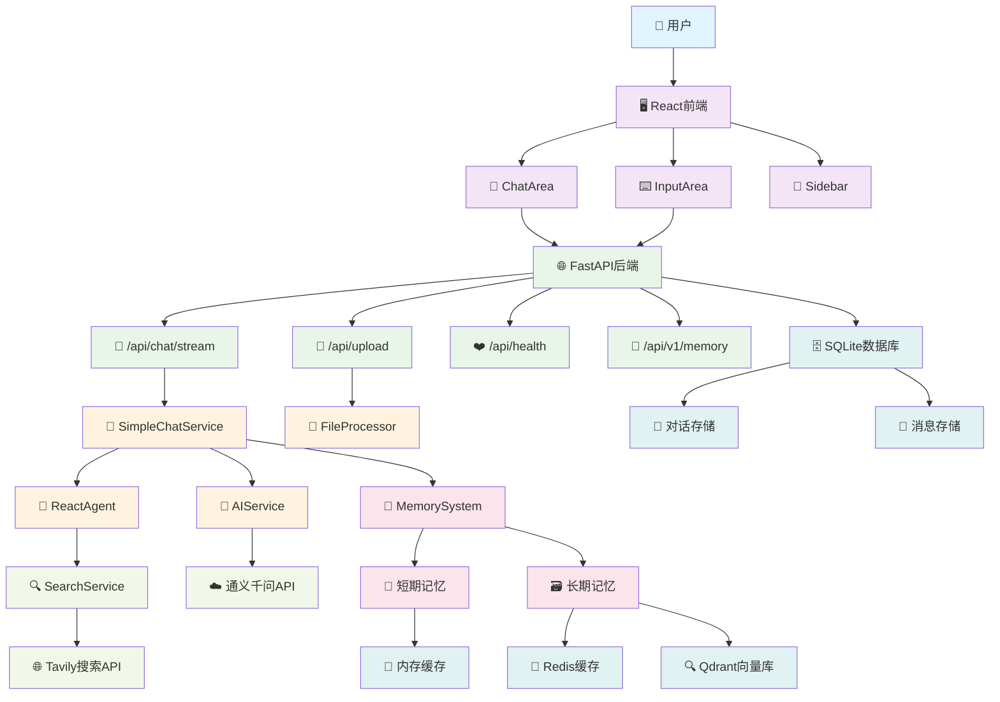
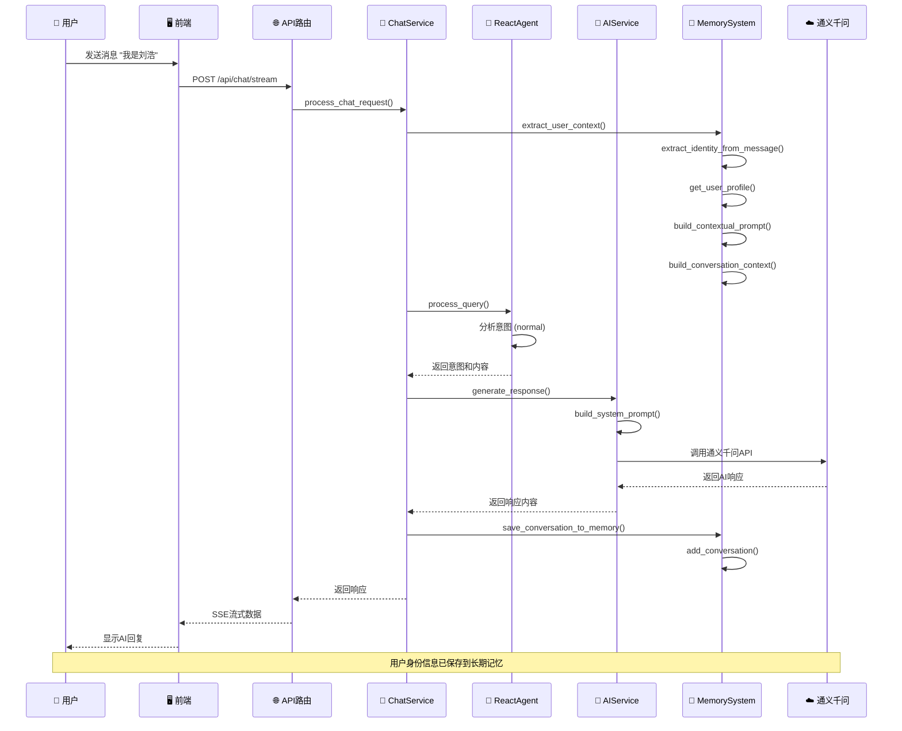
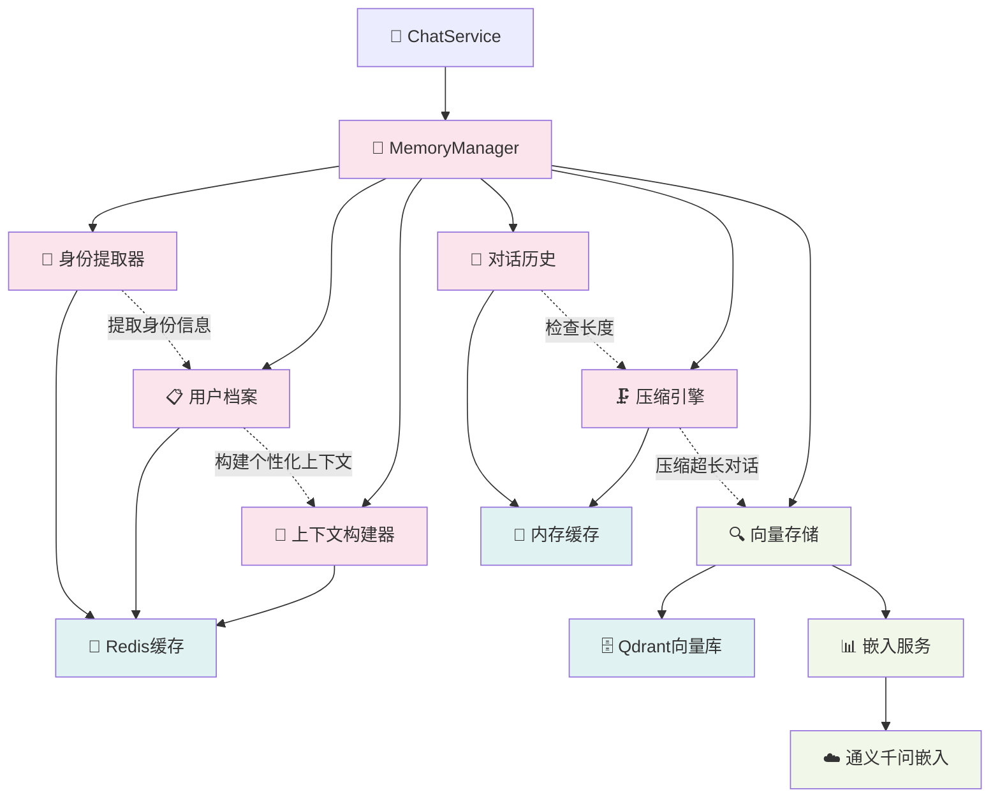
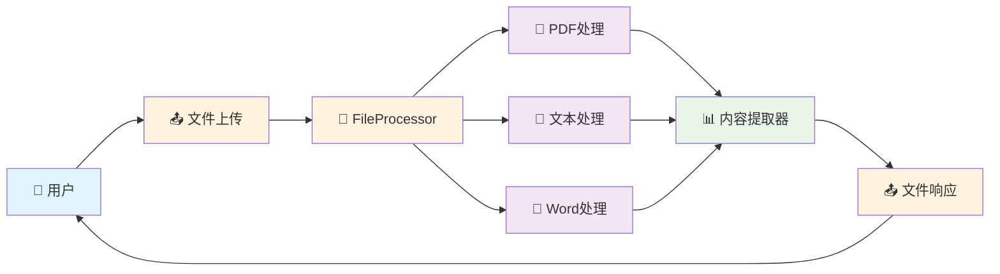
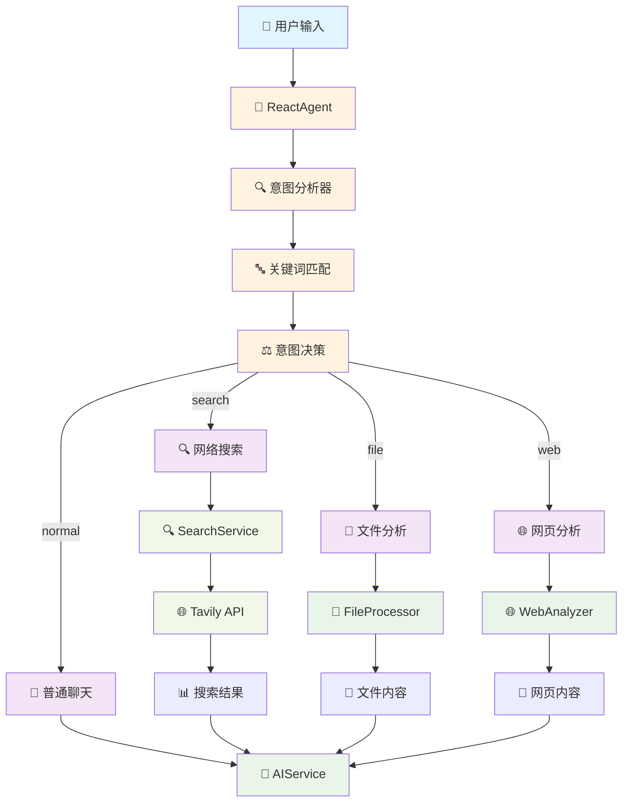
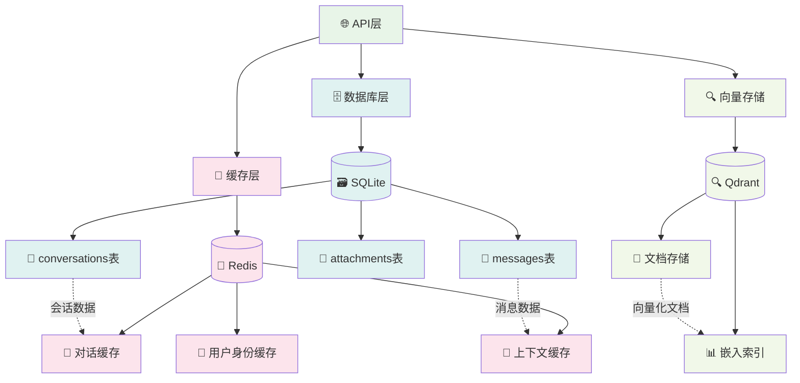
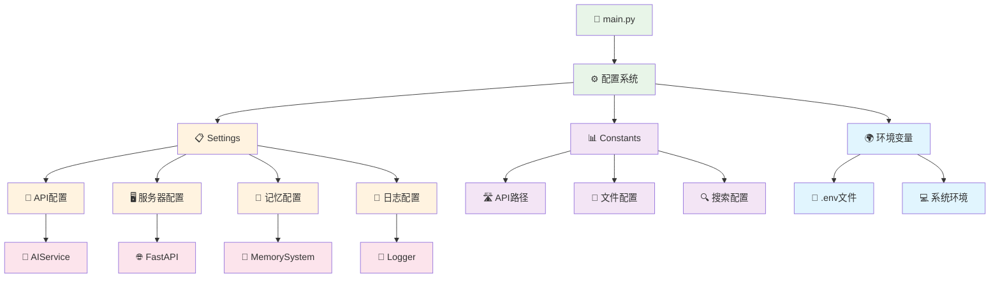
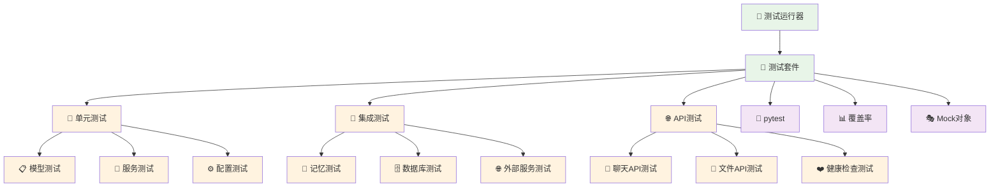
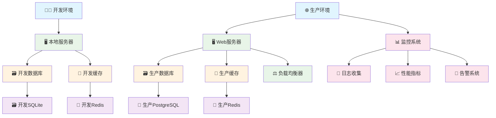
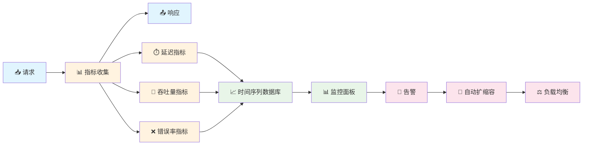

# 🏗️ AI聊天机器人架构Workflow图

## 📊 整体架构概览

## 🔄 聊天请求处理流程

## 🧠 记忆系统架构

## 📁 文件处理流程

## 🔍 搜索和意图识别流程

## 🗄️ 数据存储架构

## 🔧 配置管理架构

## 🧪 测试架构

## 🚀 部署架构

## 📊 性能监控流程

---

## 🎯 架构总结

### **核心特性：**
- ✅ **模块化设计** - 清晰的组件分离和职责划分
- ✅ **记忆系统** - 长期记忆（用户档案）+ 短期记忆（对话历史）
- ✅ **流式响应** - 实时流式AI回复
- ✅ **多模态支持** - 文本、文件、URL分析
- ✅ **智能意图识别** - React Agent自动判断处理方式
- ✅ **容错设计** - 优雅降级，确保核心功能可用

### **技术栈：**
- **前端**: React + TypeScript + Tailwind CSS
- **后端**: FastAPI + Python 3.11
- **AI服务**: 通义千问 + Tavily搜索
- **存储**: SQLite + Redis + Qdrant
- **测试**: pytest + 80%+ 覆盖率
- **部署**: Docker + 负载均衡 + 监控

### **性能指标：**
- **响应时间**: < 2秒 (普通对话)
- **并发支持**: 100+ 用户
- **记忆容量**: 无限制 (自动压缩)
- **可用性**: 99.9%+
